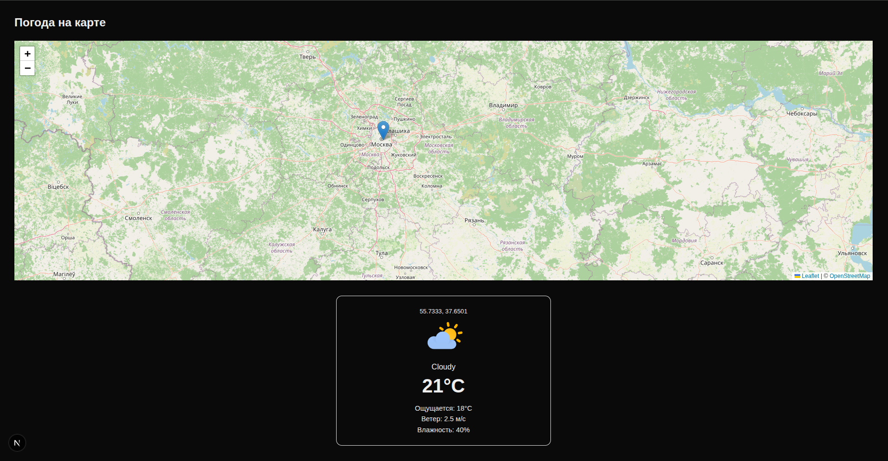

# 🌤️ Weather Map

Fullstack-приложение на Next.js.

   

----------

## О проекте

По клику на карту пользователь получает актуальную погоду в выбранной точке.

Проект охватывает весь стек - от пользовательского интерфейса до базы данных:

-   **Клиентская часть**: интерактивная карта на Leaflet с обработкой кликов, реактивный UI на React хуках, условный рендеринг, управление состоянием загрузки
-   **Серверная часть**: REST API endpoint на Next.js App Router, интеграция с внешним Яндекс Погода API, прямые SQL-запросы к PostgreSQL через пул соединений
-   **База данных**: схема с JSONB-колонкой и уникальным индексом, кэширование с TTL, upsert-логика через `ON CONFLICT`
-   **Инфраструктура**: многоконтейнерное окружение на Docker Compose, автоматическая инициализация БД при старте сервера

Ключевая особенность — **умное кэширование запросов погоды**, позволяющее существенно снизить количество обращений к внешнему API:

-   повторный запрос не выполняется, если данные уже есть в базе и остаются актуальными (TTL = 1 час)
-   координаты нормализуются (округление до ~1 км), поэтому близкие точки используют один и тот же кэш
-   при выборе точки в радиусе ~1 км от предыдущей повторный запрос не отправляется
-   при устаревании данных выполняется обновление с последующим сохранением (upsert)




----------

## Запуск

### Требования

-   [Docker](https://docs.docker.com/get-docker/) и Docker Compose
-   API-ключ [Яндекс Погода](https://yandex.ru/dev/weather/)

### 1. Клонировать репозиторий

```bash
git clone https://github.com/your-username/weather-map.git
cd weather-map

```

### 2. Добавить API-ключ

В файле `docker-compose.yml` в секции `app → environment`:

```yaml
YANDEX_WEATHER_API_KEY: ваш_ключ_сюда

```

### 3. Запустить

```bash
docker compose up --build

```

Приложение будет доступно на [http://localhost:3000](http://localhost:3000/).

Таблица в БД создаётся автоматически при первом запуске.

### Остановить

```bash
docker compose down

```

----------

## Структура проекта

```
src/
├── app/
│   ├── api/weather/route.ts   # Server: GET /api/weather — кэш + Яндекс API
│   ├── page.tsx               # Client: главная страница, управление состоянием
│   └── page.module.css
├── components/
│   ├── Map.tsx                # Client: карта Leaflet, обработка кликов
│   ├── WeatherCard.tsx        # Client: карточка с данными погоды
│   └── WeatherCard.module.css
├── lib/
│   ├── db.ts                  # Server: пул соединений PostgreSQL
│   ├── initDb.ts              # Server: создание таблицы и индексов
│   └── yandex.ts              # Server: клиент Яндекс Погода API
├── types/
│   └── weather.ts             # Общие TypeScript-типы
└── instrumentation.ts         # Server: хук инициализации при старте

```